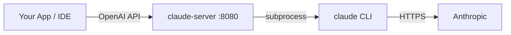

# claude-server

**Turn your Claude Code subscription into a local OpenAI-compatible API.**

If you already pay for Claude Code, you don't need a separate API subscription. `claude-server` wraps the Claude Code CLI and exposes it as a local HTTP server — point any app, IDE, or script at `localhost:8080` and use your existing session everywhere.

```bash
curl -sSL https://raw.githubusercontent.com/StaticB1/claude-server/main/install.sh | bash
claude-server start
```

## How it works



## Prerequisites

- Python 3 (no extra packages needed)
- [Claude Code](https://docs.anthropic.com/en/docs/claude-code) CLI installed and authenticated

  Verify:
  ```bash
  claude -p "say hi"
  ```

## Install

**One-liner:**
```bash
curl -sSL https://raw.githubusercontent.com/StaticB1/claude-server/main/install.sh | bash
```

**Or manually:**
```bash
git clone https://github.com/StaticB1/claude-server
cd claude-server
./install.sh
```

## Usage

```bash
claude-server start       # start in background
claude-server stop        # stop
claude-server restart     # restart
claude-server status      # check if running
claude-server log         # tail the log
claude-server uninstall   # remove from system
```

### Flags

```bash
claude-server start --port 9000          # custom port (default: 8080)
claude-server start --host 0.0.0.0      # expose to local network
claude-server start --skip-permissions  # skip tool permission prompts (for automation)
```

## Compatibility

| Tool | Status | Setup |
|:-----|:-------|:------|
| Cursor | ✅ Verified | Add OpenAI provider, set Base URL to `http://localhost:8080/v1` |
| Continue | ✅ Verified | Add as `openai` provider in `config.json` |
| LibreChat | ✅ Verified | Use custom endpoint configuration |
| Any OpenAI SDK | ✅ Works | Set `base_url="http://localhost:8080/v1"`, `api_key="local"` |

## API

### Simple API

```bash
curl -s "http://localhost:8080?q=what+is+linux"
curl -s -d '{"prompt":"explain monads in 3 sentences"}' http://localhost:8080
```

### OpenAI-compatible API

Drop-in replacement for `https://api.openai.com/v1`.

```bash
curl -s http://localhost:8080/v1/chat/completions \
  -d '{"model":"claude","messages":[{"role":"user","content":"hello"}]}'
```

**Streaming:**

```bash
curl -s http://localhost:8080/v1/chat/completions \
  -d '{"model":"claude","stream":true,"messages":[{"role":"user","content":"hello"}]}'
```

**Python (openai package):**

```python
from openai import OpenAI

client = OpenAI(base_url="http://localhost:8080/v1", api_key="local")

# Standard
response = client.chat.completions.create(
    model="claude",
    messages=[{"role": "user", "content": "hello"}],
)
print(response.choices[0].message.content)

# Streaming
for chunk in client.chat.completions.create(
    model="claude",
    messages=[{"role": "user", "content": "hello"}],
    stream=True,
):
    print(chunk.choices[0].delta.content or "", end="", flush=True)
```

**Python (no dependencies):**

```python
import urllib.request, json

req = urllib.request.Request(
    "http://localhost:8080",
    data=json.dumps({"prompt": "what is 2+2?"}).encode(),
    headers={"Content-Type": "application/json"},
)
print(json.loads(urllib.request.urlopen(req).read())["response"])
```

**Node.js:**

```javascript
const r = await fetch("http://localhost:8080", {
  method: "POST",
  headers: { "Content-Type": "application/json" },
  body: JSON.stringify({ prompt: "what is 2+2?" }),
});
console.log((await r.json()).response);
```

## Endpoints

| Method | Path | Description |
|--------|------|-------------|
| `GET` | `/?q=<prompt>` | Send a prompt via query string |
| `POST` | `/` | Send `{"prompt": "..."}` |
| `GET` | `/health` | Health check |
| `GET` | `/v1/models` | List available models |
| `POST` | `/v1/chat/completions` | OpenAI-compatible chat (streaming supported) |

## Security

By default the server only listens on `127.0.0.1` (localhost). Use `--host 0.0.0.0` only on trusted networks — anyone who can reach the port can use your authenticated Claude session.

## Disclaimer

"Claude" and "Claude Code" are trademarks of Anthropic PBC. This project is an independent, open-source tool and is not affiliated with, endorsed by, or sponsored by Anthropic.

This tool automates the Claude Code CLI for personal use. It may be subject to [Anthropic's Terms of Service](https://www.anthropic.com/legal/consumer-terms). Use at your own risk.

## License

MIT
